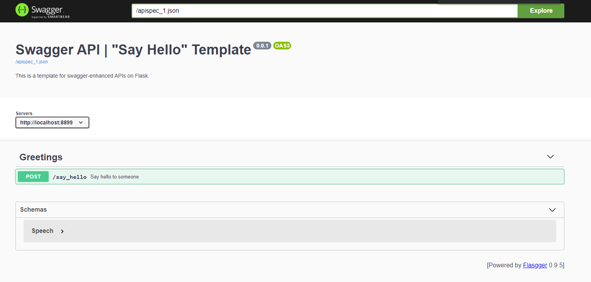
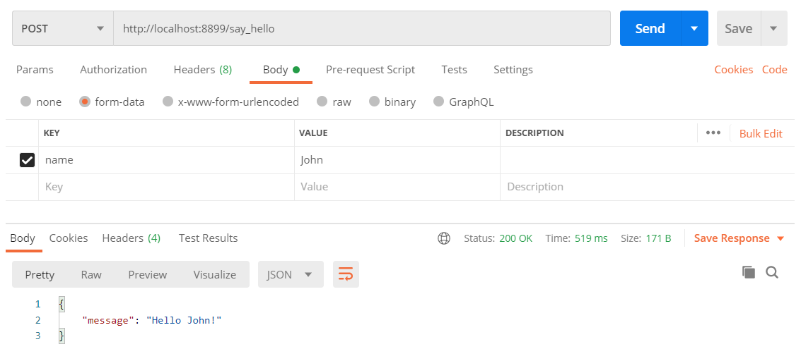

# Swagger API | "Say Hello" Template 




## Send Requests

To send a request via Python:
```python
import json
import requests

server = "http://localhost:8899"

response = requests.post(f"{server}/say_hello", data={"name": "John"})
result = json.loads(response.text)
result
>>> { "message": "Hello John!" }
```

To send files along form data, e.g. an image (pretty useless for our "say_hello" method):
```python
import json
import requests

server = "http://localhost:8899"
img_path = "/path/to/image.jpg" 

response = requests.post(f"{server}/say_hello",
                         files={"input": open(img_path, "rb").read()},
                         data={"useless_file": "John"})
result = json.loads(response.text)
result
>>> { "message": "Hello John!" }
```


To send a request via Postman:




## How to deploy

This server is dockerized, so it can be built and run using docker commands.

### Docker build

```
docker build -f Dockerfile -t say-hello-api:latest  .
```

### Run Docker

```
docker run -d -p <API_PORT>:8899 --restart-always --name say-hello-api say-hello-api:latest
```

Now the server is available at ``http://<HOST>:<API_PORT>``.
